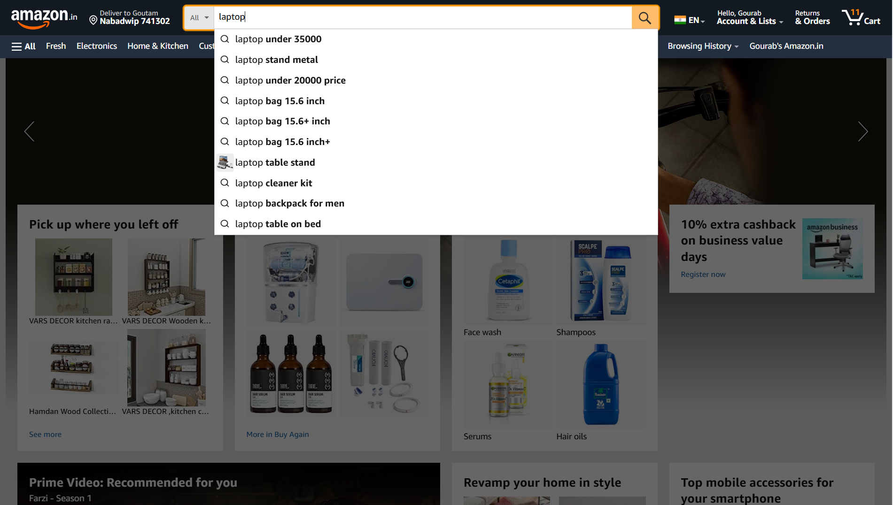

# 🛒 **Automating Amazon Store Search and Navigation**  

<p align="center">
  
  
  
  
  
  
</p>

## 🌟 **Project Overview**  
This project focuses on automating the **search feature** of the Amazon store, ensuring accurate and relevant results. Additionally, it validates key navigation menus and footer links to enhance user experience and ensure data consistency.  

Key functionalities include:  
- Testing the Amazon search functionality.  
- Validating navigation menu links.  
- Verifying data consistency in search results.  

---

## 🚀 **Scope of Work**  
The following test cases were automated using **Selenium** and **XPath**:  
1. ✅ Verify the **URL of the Homepage**.  
2. 🔍 Test the **Search Functionality**.  
3. 📂 Validate the **Navigation Menu**.  

---

## 🛠️ **Skills & Technologies Used**  
- **Selenium WebDriver** for automating browser interactions.  
- **XPath** for efficiently locating web elements.  
- **Java** for writing clean and reusable automation scripts.  

---

## 📸 **Snapshots of the Work**  
### **Amazon Homepage Automation**  
  

### **Search Feature in Action**  
  

---

## 📚 **How to Run the Automation**  
1. Clone this repository:  
   ```bash
   git clone https://github.com/Gourab-Pal/QA-Amazon_automation.git
